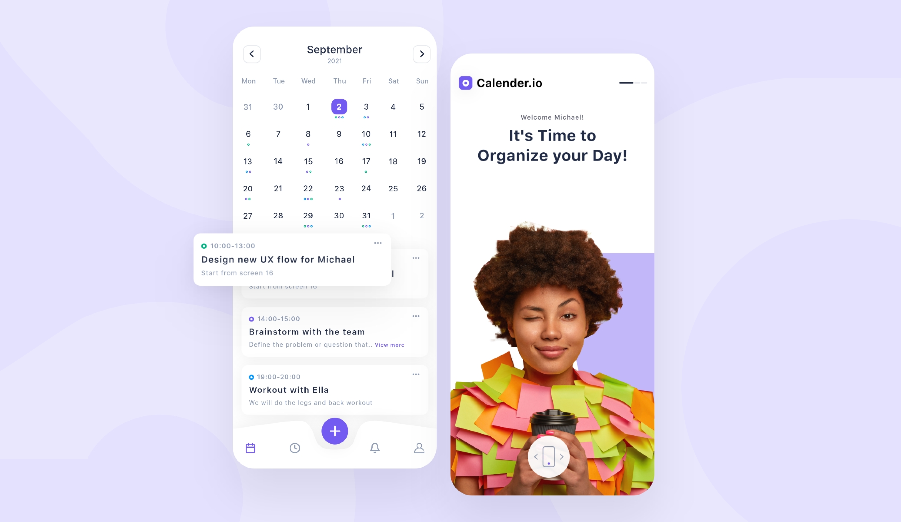

# Calendo IO | Event Manager App

This project is a mobile application designed to manage and organize events, with the main objective of exercising the integration of technologies like **RealmDB** and **Formik**, along with creating a user-friendly interface.



## Features

-   **RealmDB**: Used to handle local data storage, providing efficient, real-time database management for events.
-   **Formik**: Simplifies form handling with built-in validation using **Yup**.
-   **Date and Time Pickers**: Enables users to select and validate event dates and times.
-   **Category Selection**: Users can select categories using a chip UI component.
-   **Reminder Toggle**: Option to set a reminder for the event.

## Technology Stack

-   **React Native**: Main framework for building the mobile app.
-   **RealmDB**: Database solution for managing event data offline.
-   **Formik & Yup**: For handling forms and validation.
-   **react-native-switch**: Custom switches for user interaction.
-   **react-native-material-chips**: Chip-based UI for category selection.
-   **react-native-datetimepicker**: Integrated date and time pickers.

## Project Purpose

The primary goal of this project is to exercise the following:

-   Implementing **RealmDB** for local database handling.
-   Using **Formik** to manage form state and validation.
-   Creating UI components for event management (date, time pickers, category selection).
-   Improving familiarity with React Native UI best practices.

## Setup and Running

1. Clone the repository:

    ```bash
    https://github.com/CodeFlux-Labs/calendo-io.git
    cd calendo-io

    ```

2. Install dependencies:

    ```bash
    yarn

    ```

3. To run on a device:
    ```bash
    yarn android
    ```

## Example Usage

-   On the home screen, users can add or update events, select a category, set reminders, and manage start/end times for each event.
-   All data is stored locally in RealmDB, allowing offline-first behavior.
